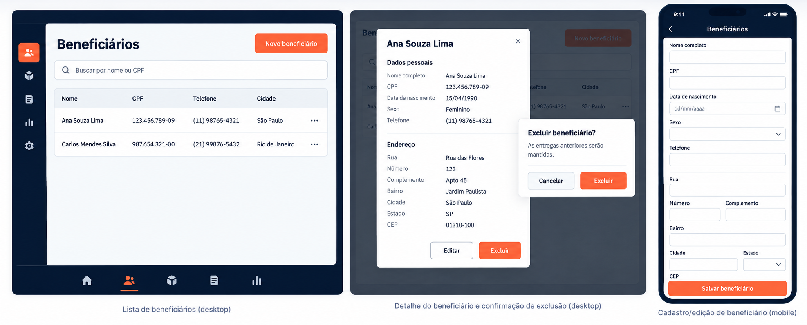

# Beneficiary Management

## Summary

Status: updated on 2026-10-04. Beneficiary listing, details, create, edit, soft-delete, deleted-record listing, and restoration use the API.

The generated design reference is illustrative; centralized theme tokens, responsive rules, accessibility, and this written behavior take precedence.

## Screens and navigation

- Keep the **Beneficiários** tab as the entry point. Replace its placeholder with a searchable list and a clear **Novo beneficiário** action.
- On phones, render tappable beneficiary cards; on larger windows, render `ThemedTable`. Show name, full formatted CPF, phone, and city/state. Selecting a row opens the details modal.
- The details modal shows all beneficiary fields, including the full address, and offers **Editar** and **Excluir** actions.
- Create and edit use dedicated routes at `/beneficiaries/new` and `/beneficiaries/[id]/edit`. Keep route adapters thin and feature logic under `src/features/beneficiaries/`.
- Use one delete-confirmation state within the details modal rather than stacking modals. Explain that previously recorded deliveries remain. Provide a separate screen reachable from the beneficiary list to search soft-deleted records and restore them.

## Shared CRUD presentation

Use the shared `CrudScreenLayout` under `src/components/ui/` for beneficiary management, then reuse it in other CRUD features.

- The future supply-management CRUD screen must use this same `CrudScreenLayout`; do not create a separate page shell for Mantimentos.

- Its interface is compositional: `title`, optional `description`, optional `primaryAction` (`label`, `onPress`, and optional loading/disabled state), optional `toolbar`, required content, and optional `footer`.
- It provides consistent responsive page spacing, heading/action alignment, and content surface styling using existing `Screen`, `ThemedCard`, and semantic theme tokens.
- It does not own API calls, query state, validation, form fields, tables/cards, deletion dialogs, pagination policy, or domain-specific copy. Features compose `SearchField`, `ThemedTable`, and their own mobile rows and forms within its slots.
- Test the layout as a generic component and keep its props independent of beneficiary types.

## API, forms, and behavior

- Use the authenticated endpoints: `GET /beneficiaries`, `GET /beneficiaries/deleted`, `GET /beneficiaries/:id`, `POST /beneficiaries`, `PATCH /beneficiaries/:id`, `PATCH /beneficiaries/:id/restore`, and `DELETE /beneficiaries/:id`.
- Search names with `search`; send CPF as `cpf` only when the entered value normalizes to exactly 11 digits. For an incomplete CPF-like query, show a Portuguese inline hint and do not send an invalid request.
- Paginate list results with the existing response contract and `useInfiniteQuery`, 20 records per page, a **Carregar mais** action, query cancellation via the Axios signal, and no persisted cache.
- Revalidate the active and deleted beneficiary lists when their routes regain focus on mobile; do not issue a duplicate fetch on first opening.
- Create and edit forms contain all business fields: name, CPF, birth date, sex, phone, and address. All of these fields remain editable during edit, including CPF and birth date. System metadata such as IDs and timestamps is not part of the form.
- Use React Hook Form, Zod, `zodResolver`, and the shared `TextField`. Keep validation messages in Portuguese next to fields, not in toasts. Use a calendar date picker for birth date with a year selector reached by tapping its month/year heading, prevent future dates, and preserve the calendar day as `YYYY-MM-DD`.
- Format CPF, phone, and postal code for display and submit normalized values accepted by the API. Map sex `M`/`F` to **Masculino**/**Feminino**. Normalize state abbreviations to uppercase.
- Address fields are street, number, optional complement, neighborhood, city, state, and postal code. Submit `null` when the user clears an existing complement.
- On successful create/update, return to the list or previously opened details modal, refresh the beneficiary query, and show one centralized Portuguese success toast. On failures, retain form values and rely on normalized API error toasts. A CPF conflict—including one caused by a soft-deleted record—must not clear the form.
- Soft deletion calls the `DELETE` endpoint, closes the details modal after success, refreshes the list, and shows one success toast. Failed deletion leaves the modal open. Restoring a record calls the restore endpoint, refreshes both active/deleted lists, and shows a success toast.

## Tests and acceptance

- Test `CrudScreenLayout` renders its title, toolbar, content, action, and footer slots without feature-specific dependencies.
- Test list loading, empty/error/retry states, name/full-CPF searches, incomplete CPF hint, load-more behavior, and opening the details modal.
- Test create/edit validation and payload normalization, editable CPF and birth date, future-date rejection, complement clearing, failure value preservation, and duplicate-CPF feedback.
- Test details content, edit navigation, delete confirmation/cancellation, successful soft delete, deleted-record search/restore, retained historical deliveries, and list refresh after mutations.
- Verify inline form errors do not trigger toasts, while operation success/errors use the centralized notification service exactly once.
- Check light/dark themes and responsive layouts at narrow/wide phone, tablet portrait/landscape, and desktop widths; verify keyboard access and modal focus behavior. Native keyboard/safe-area checks still require an emulator or device.

## Implementation notes

- The tab now contains the searchable list, with mobile cards and a wider-screen table. Details, edit navigation, soft-delete confirmation, create/edit routes, and the deleted-beneficiaries restore flow are implemented in the beneficiary feature.
- All business fields, including CPF and birth date, remain editable during editing. Birth date uses an accessible calendar control and is submitted as the date-only `YYYY-MM-DD` value.
- Shared CRUD framing lives in `src/components/ui/crud-screen-layout.tsx`; the form, calendar, detail modal, masks, and beneficiary queries stay feature-local.
- The app uses the beneficiary API for active/deleted listings and restoration; no new dependencies were needed.
- A later extension adds a **Ver histórico** action that opens the shared `AuditHistoryModal` from `src/components/AuditHistoryModal/`. Keep its modal, hook, types, display helpers, and tests together in that component package so other features can reuse it. The modal reads paginated `GET /audit-logs`, filters by entity type/optional entity ID, and applies a start/end date range while displaying the actor, timestamp, and field-level before/after changes.
- Verification updated on 2026-10-04: 17 app Jest suites/75 tests, `tsc --noEmit`, API build, and 14 API unit suites/101 tests passed. The PostgreSQL integration test for deleted listing/restoration was added but could not run because Docker is unavailable in the environment. Device/emulator checks for native keyboard and safe-area behavior remain outstanding.
