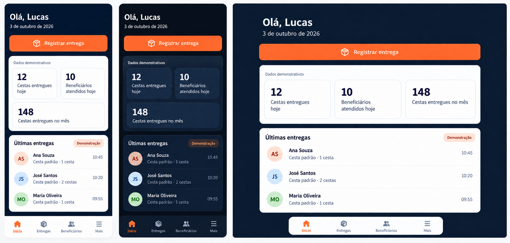
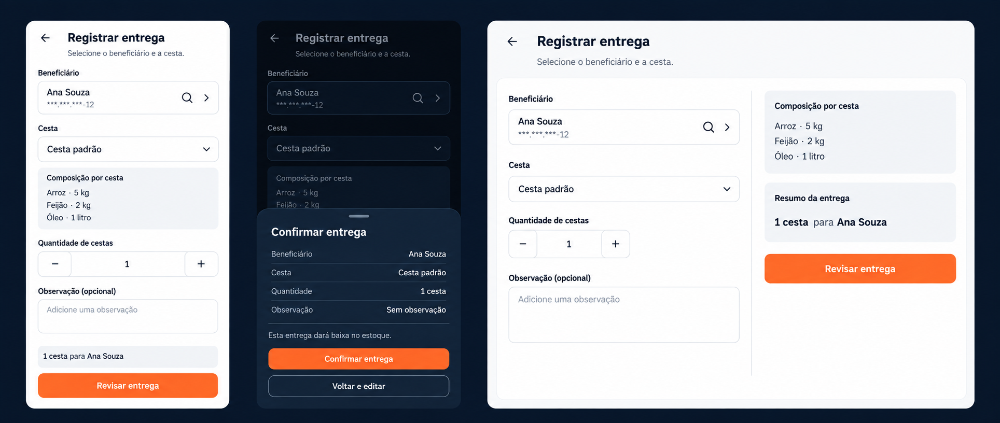

# Home, Bottom Navigation, and Basket Delivery Registration

## Summary

Status: implemented on 2026-10-03. The visual references remain illustrative; the implementation and verification notes below describe the delivered frontend.

Build an institution-wide home and bottom navigation, plus a working delivery registration flow using existing API endpoints.

Home indicators and recent deliveries remain mocked and explicitly labeled as demonstration data. No backend changes are included.

## Visual references

The following mockups are design references, not implemented screens. Their names, dates, basket compositions, and quantities are illustrative. Runtime content must follow the behavior and contracts defined in this plan. The written specification and centralized theme tokens take precedence over approximate image colors or typography.

### Responsive home

Phone light mode, phone dark mode, and desktop web light mode.

The scope chip has been removed from all three variants. The generated desktop reference contains an incorrect monthly-period label on the center indicator; implement **Beneficiários atendidos hoje** with the daily definition specified below. The mockup does not change this requirement.

### Delivery registration and review

Phone registration in light mode, phone review in dark mode, and desktop registration in light mode.

These references were generated with the built-in image generation tool. No additional skill installation is required for implementation.

## Screens and navigation

- Replace the Expo starter screens with four tabs: **Início**, **Entregas**, **Beneficiários**, and **Mais**.
- Keep navigation at the bottom on phones, tablets, and web. On desktop, use a centered dock.
- Use Expo Router's standard `Tabs` across platforms and compatible `@expo/vector-icons` icons. Preserve the existing authentication guard.
- **Início:** authenticated user's first name, current date, prominent “Registrar entrega” action, three indicator cards, and three recent demonstration deliveries. The institutional scope is implicit; do not display a scope chip.
- Indicators: **Cestas entregues hoje**, **Beneficiários atendidos hoje**, and **Cestas entregues no mês**. Initial mock values: 12, 10, and 148.
- Display “Dados demonstrativos” above the indicators and “Demonstração” beside recent deliveries. Demonstration entries are not clickable.
- **Entregas:** functional “Registrar entrega” action and “Histórico de entregas ainda não disponível.”
- **Beneficiários:** informative placeholder; beneficiary management is reserved for a later stage.
- **Mais:** logged-in user's name and email, existing logout action, and disabled “Cestas” and “Estoque” entries marked “Em breve”.
- Registration opens at `/deliveries/new`, outside the tab shell, with a back action.

## Delivery registration

Use one form followed by a review dialog: a bottom sheet on phones and a centered dialog on larger screens.

- **Beneficiário:** searchable selector backed by `GET /beneficiaries`. Search names with `search`; use `cpf` only for an input containing exactly 11 digits after removing formatting. Partial CPF input requests completion instead of sending an invalid query.
- **Cesta:** searchable selector backed by `GET /baskets`. Show the selected basket's composition and translate supply units into Portuguese.
- Both selectors load the first page when opened, debounce searches by 300 ms, request 20 records per page, and provide “Carregar mais”. Reset pagination on search changes and prevent stale responses from replacing current results.
- Display beneficiary names, masked CPFs, and city/neighborhood where useful for identification.
- **Quantidade de cestas:** editable integer, default 1, with increment/decrement controls; validate the existing API range of 1–2,147,483,647.
- **Observação:** optional multiline input, maximum 2,000 characters.
- Use React Hook Form, Zod, `zodResolver`, and the existing `TextField`. Selectors and quantity controls participate in the same form validation. Display frontend validation messages inline beside their fields, not in toasts; focus the first invalid field when submitting an invalid form.
- “Revisar entrega” validates the form and displays beneficiary, basket, quantity, observation, and “Esta entrega dará baixa no estoque.”
- “Voltar e editar” preserves the form. “Confirmar entrega” sends one `POST /basket-deliveries` with `beneficiaryId`, `basketId`, numeric `quantity`, and optional trimmed `observation`.
- Do not send an actor ID or delivery date; the API supplies those values.
- Close the review dialog when confirmation starts and lock the form while pending. The root toast host remains visible during the request and subsequent navigation. Show normalized Portuguese errors through the centralized toast service and preserve inputs on failure. Stock availability remains authoritative on the backend.
- After a successful response, emit “Entrega registrada com sucesso.” through the API hook's configured success toast. Display a neutral “Resumo da entrega” view with the confirmed delivery details and actions “Registrar outra entrega” and “Voltar ao início”; do not duplicate the success message in a banner or heading.
- Do not automatically retry POST requests. For a connection failure with an uncertain outcome, explain that registration could not be confirmed and ask the operator to verify before retrying.
- Real registrations do not alter demonstration indicators or demonstration history.

## Architecture and visual specification

- Keep route files thin and organize screens, hooks, validation, types, and fixtures by feature: home, delivery registration, and account.
- Keep mock data inside the home feature. Expose it through a typed home-overview hook so a future API integration can replace the data source without rewriting the screen.
- Extend `API_ROUTES` with the existing beneficiary, basket, and basket-delivery endpoints. Compose feature hooks from the shared Axios request hooks; do not introduce caching.
- Follow the shared UI inventory and feature boundaries below. Shared components are presentational and must not fetch data or know beneficiary, basket, or delivery contracts.
- Follow centralized NativeWind color and typography tokens. Retain navy backgrounds, white light-mode surfaces, dark navy dark-mode surfaces, and orange primary actions.
- Ensure button text and active navigation labels meet contrast requirements; use a centralized `textOnForeground` token for orange buttons. The written specification takes precedence over approximate image colors.
- Phone layouts use two indicator columns with the third card spanning both. Tablet/desktop layouts use three columns. Registration becomes a form-plus-summary layout on desktop.
- Respect safe areas, keyboard visibility, scrolling, accessible labels, keyboard navigation, and modal focus behavior.
- Keep this documentation in `app/plans/` and its visual references in `app/plans/assets/`. Keep all user-facing copy in Brazilian Portuguese and the plan itself in English.

## Toast notifications

- Use `react-native-toast-message` as the app-wide notification library. Add the dependency during implementation, not as part of this documentation update.
- Expose a JavaScript service in `src/services/notifications.ts` with `notifications.error(message)` and `notifications.success(message)`. Feature code and hooks call this service instead of importing the library or rendering their own notification widgets.
- Render one shared `AppToastHost` at the application root inside the theme and safe-area boundaries, outside individual screens and authentication redirects. Configure the host with centralized theme tokens and Portuguese messages. Success toasts last 4 seconds; error toasts last 6 seconds; both support dismissal and accessible announcements.
- `ThemedModal` renders the same host inside an open native modal so notifications remain visible above it. Use the library's documented active-instance behavior; do not implement a second notification service or repeat modal toast setup in features.
- Centralize normalized mutation-error notifications in `useApiRequest`, now backed by TanStack Query's `useMutation`/`mutateAsync`. Preserve its error state and rejected-promise behavior. Use mutation callbacks to notify once for the current failed mutation; cancellation and superseded requests are control flow and must not produce error toasts.
- Query implementation update: paginated selectors use TanStack Query's `useInfiniteQuery` with query keys for filters, `getNextPageParam` for paging, and the provided abort signal passed to Axios. POST/DELETE use `useMutation`; a root `QueryClientProvider` owns read and mutation state. Inactive queries and mutations are discarded and no persistent cache is configured. The shared query cache emits normalized GET-error toasts; mutation callbacks in `useApiRequest` emit POST/DELETE notifications. Canceled reads do not notify.
- Extend generic request-hook options with optional `successMessage` and `errorMessage` (a string or a function of the normalized error), separate from `AxiosRequestConfig`. Mutation hooks pass these options to the common request hook. Feature hooks supply operation-specific Portuguese text; the common layer actually triggers the toast. Successful GET requests have no success toast by default.
- Show success only when the operation being reported is complete. For composed workflows such as login plus session persistence, let the owning feature hook notify after the complete workflow and leave the lower-level request's success message unset.
- All user-facing operation errors and success messages, including non-request operations such as session persistence and logout, use this service. Frontend field-validation errors are an exception and remain inline. Trigger operation notifications from the most general hook or service that owns the operation; screens must not repeat messages already emitted by a hook.
- Keep Zod/React Hook Form field errors next to their corresponding inputs, selectors, and quantity controls, with Portuguese messages, invalid styling, and accessibility metadata. Invalid submission focuses the first invalid field without emitting a toast. Do not create a toast-oriented `useFormFeedback` hook or move existing field-validation messages into toasts.
- Normalize network failures, timeouts, and unexpected errors to safe Portuguese messages before notification. Do not expose raw Axios, JavaScript, or infrastructure text. For an uncertain delivery POST outcome, configure the operation-specific error message at the delivery hook; do not emit an additional screen-level toast.
- Include migration of existing login/register operation-error and success feedback to this policy. Preserve their existing inline field validation, request, authentication, and inactive-registration behavior.
- Keep loading, empty states, static instructions, confirmation questions, and delivery summaries as screen content. They are not error/success notifications. Retry controls may remain on the affected view without repeating the error message.
- Official references: [quick start](https://github.com/calintamas/react-native-toast-message/blob/main/docs/quick-start.md), [custom layouts](https://github.com/calintamas/react-native-toast-message/blob/main/docs/custom-layouts.md), and [modal usage](https://github.com/calintamas/react-native-toast-message/blob/main/docs/modal-usage.md). Validate the chosen package with the existing Expo/React Native versions on web and native during implementation.

## Shared UI inventory

Create these generic visual primitives under `src/components/ui/`; keep their contracts independent of API and feature data.

| Component | Responsibility and contract | Initial consumers |
| --- | --- | --- |
| `ThemedButton` | Label, press action, primary/secondary variants, loading, disabled state, optional icon, and accessible feedback. | Home, delivery registration/review, account, authentication. |
| `ThemedCard` | Themed surface, border, padding, and children; no KPI or domain-specific content. | Home indicators/recent-delivery container, delivery summary, account. |
| `ThemedModal` | `visible`, title, dismissal callback, children, and optional footer; mobile sheet/desktop dialog presentation, keyboard/safe-area handling, focus restoration, and modal toast host. | Beneficiary selector, basket selector, delivery review; later features reuse the same shell. |
| `SearchField` | Controlled `value`, change handler, optional submit handler, placeholder, search icon, and clear action. No fetching, debounce, pagination, or knowledge of CPF. | Beneficiary and basket searches. |
| `ThemedTable<T>` | Typed rows, column definitions with cell renderers, stable row keys, optional row-selection callback, loading/empty presentation, and accessible headers. No API calls, domain filters, sorting policy, or automatic pagination. | Desktop recent deliveries and desktop selector results. |
| `ThemedEmptyState` | Title, optional explanatory text, and optional action; no domain decisions. | Placeholder tabs, empty selector results, and table empty states. |

Reuse `TextField` rather than introducing a second form-input component. Keep its React Hook Form contract compatible; expose its existing controlled input primitive for `SearchField` to reuse styling without requiring a form instance. Preserve its inline field-validation messages, invalid styling, and accessibility metadata; selectors and quantity controls follow the same field-feedback pattern.

Create `AppToastHost` as shared infrastructure under `src/components/`, backed by the shared notification service. Reuse its configuration in root and modal hosts.

Keep the following components inside their owning features:

- Home: `HomeIndicators`, `RecentDeliveries`, and the compact mobile `RecentDeliveryRow`. Desktop `RecentDeliveries` composes `ThemedTable`; domain column definitions remain local.
- Delivery registration: `BeneficiarySelector`, `BasketSelector`, `BasketComposition`, `DeliveryQuantityField`, `DeliveryReview`, and `DeliverySummary`. Selectors compose `ThemedModal`, `SearchField`, and `ThemedTable` where appropriate, but own their searches, pagination, rows, and domain types. Mobile results use feature-owned compact rows rather than a forced desktop table.
- Account: account details and future-management menu content. They compose shared buttons and cards.

Do not create a generic selector, KPI widget, quantity stepper, or summary abstraction solely because its layout could theoretically be reused. Extract feature-local components only when another feature actually needs their generic behavior.

## Verification and acceptance

- Add frontend tests using Expo-compatible Jest and React Native Testing Library, mocking API requests rather than modifying the backend.
- Test name/CPF searches, pagination, stale-response handling, quantity limits, observation limits, missing selections, and preservation of values when returning from review.
- Verify that review sends no request, confirmation sends exactly one correct POST, pending submission blocks duplicates, failures preserve the form, and success appears only after a successful API response.
- Verify that home demonstration data remains labeled and unchanged after a real registration.
- Test navigation, authenticated access, and existing logout behavior.
- Verify the scope chip is absent in the home and its visual reference.
- Test one error toast per current failed request, configured mutation success messages, no success notification for ordinary GETs, and no notifications for cancellation or superseded requests. Verify Portuguese fallbacks and delivery-specific uncertain-outcome feedback.
- Test that frontend form-validation errors appear inline beside the correct fields, focus the first invalid field on submit, block submission/review, and emit no toast. Check the same behavior on existing authentication screens; operation errors and logout feedback still use toasts.
- Verify root notifications survive navigation and that notifications triggered inside selectors appear above `ThemedModal` on both web and native.
- Test shared table row rendering/selection and reusable modal/search behavior independently of feature API contracts.
- Run TypeScript and lint checks; validate light/dark layouts at narrow and wide phone widths, tablet portrait/landscape, and desktop web.
- Check the versioned Expo 57 documentation before implementing navigation or adding Expo dependencies.
- Acceptance: an authenticated operator can select an existing beneficiary and basket, review a delivery, register it through the existing API, and receive a clear confirmation without any backend changes.

## Implementation and verification notes

- Route adapters delegate to home, delivery, beneficiary-placeholder, and account features. Registration uses the existing API contracts; no backend files were changed.
- Keep the root navigator and root toast host mounted. Apply the existing authentication guard at the authenticated tab layout, authentication layout, and standalone delivery route. Unmounting the root navigator during an authentication redirect resets notification state and loses logout feedback.
- GET requests expose cancellation. Selector searches abort and invalidate pending requests when closed or superseded, including the debounce interval, and keep pagination/results scoped to the current search.
- The shared user contract lives in `src/types/user.ts`, so global context does not depend on authentication feature types.
- Run `npm test -- --runInBand`, `npx tsc --noEmit`, `npm run lint`, and `npx expo export --platform web` from `app/`.
- Jest Expo and React Native Testing Library cover field validation, search filters/debounce/pagination, cancellation and stale responses, review/edit preservation, exact mutation payloads, duplicate submission protection, request notifications, authentication guards, session restoration/logout, and shared UI.
- Chromium checks used mocked API responses only: no production delivery was created. Home and registration were checked in light/dark modes at 360, 430, 768, 1024, and 1440 pixels. Checks also covered inline invalid-field focus, review without a request, confirmation, toast persistence across navigation, selector errors above the modal, Escape/focus restoration, failure preservation, and logout.
- Web export and native-component tests do not replace device validation. Android/iOS keyboard behavior, safe areas, screen-reader behavior, and toast layering still require a physical device or emulator smoke test.
